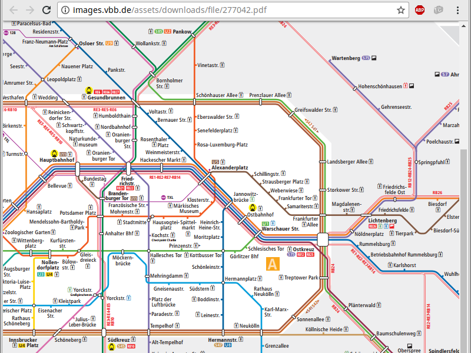
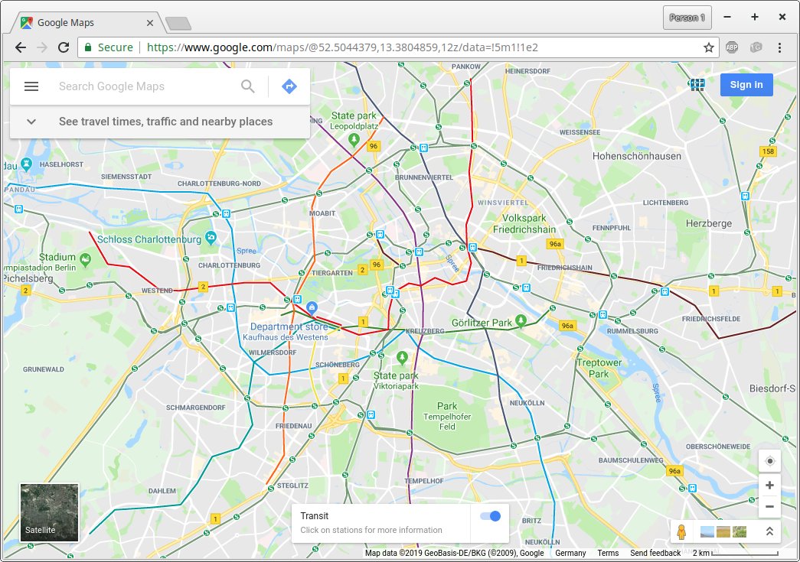
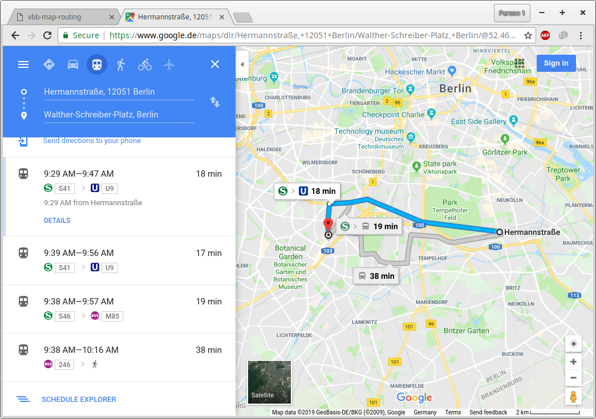
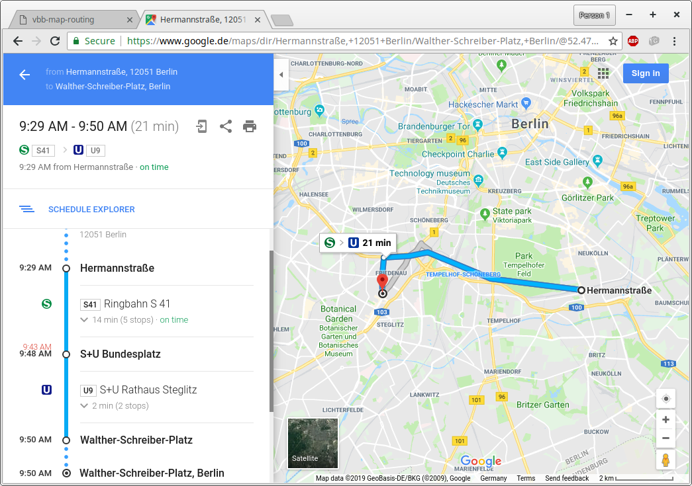
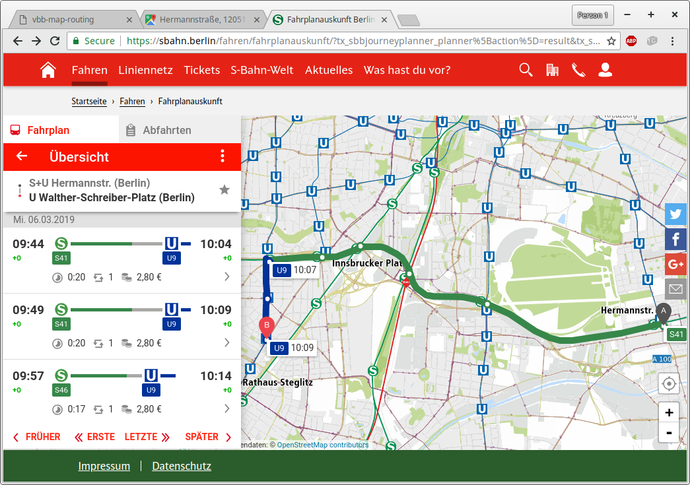
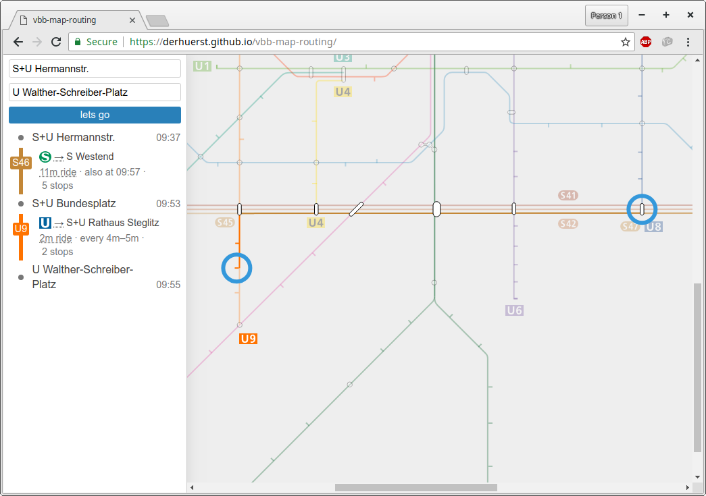
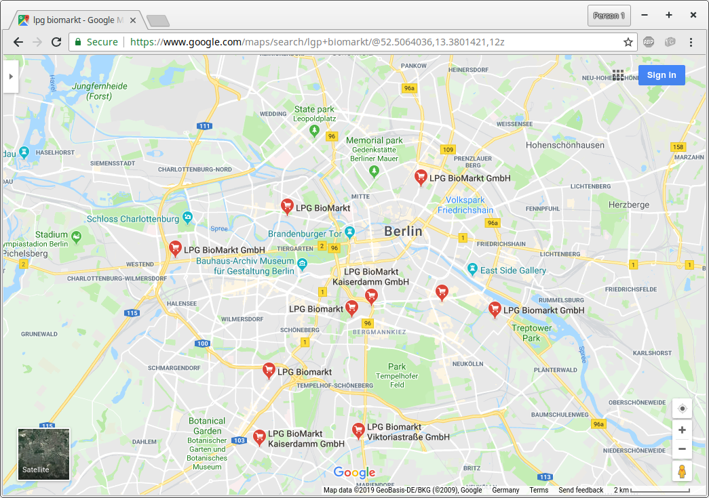
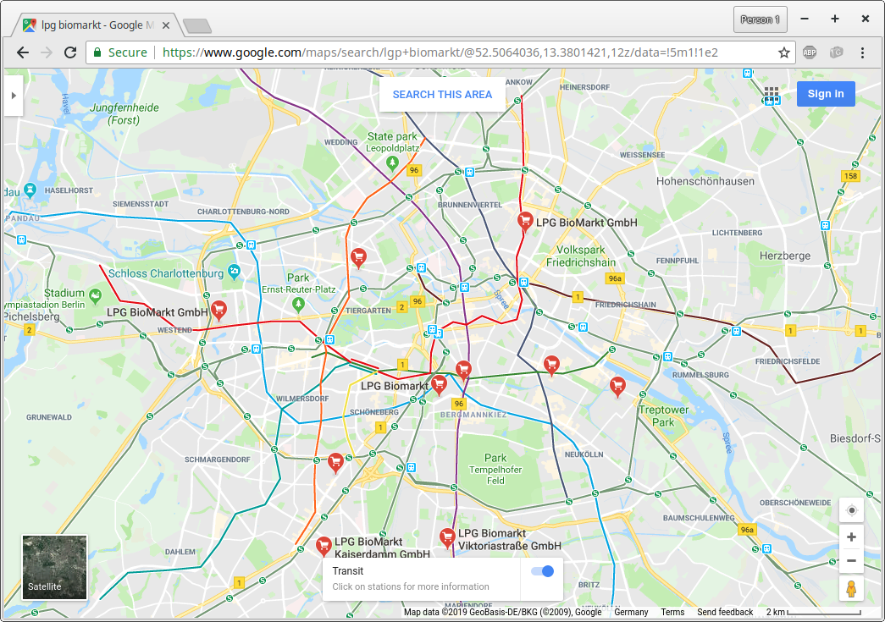
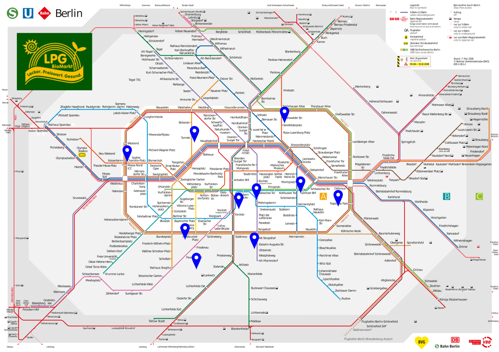

@title[Start]

## OpenMetroMaps

#### free maps for transit networks

### 6 March 2019

---

@title[OpenMetroMaps]

### OpenMetroMaps

#### Motivation
#### Project History
#### Technical Overview
#### Applications / Ideas
#### Startup Idea

---

## Motivation

---
@title[BVG S+U]

---
@title[Google Maps transit]

---
@title[Route on Google Maps]

---
@title[Route on Google Maps]

---
@title[Route on S-Bahn.berlin]

---
@title[Route on schematic map]

---
@title[LPG on Google Maps]

---
@title[LPG on Google Maps with transit]

---
@title[LPG on BVG]

---?image=assets/images/berlin-english.png&size=contain
@title[S+U Englisch]

---?image=assets/images/mitvergnuegen-icecream.png&size=contain
@title[MV Eisläden]

---?image=assets/images/mitvergnuegen-clubs.jpg&size=contain
@title[Clubs]

---?image=assets/images/miet-map-berlin.jpg&size=contain
@title[Mietpreise]
